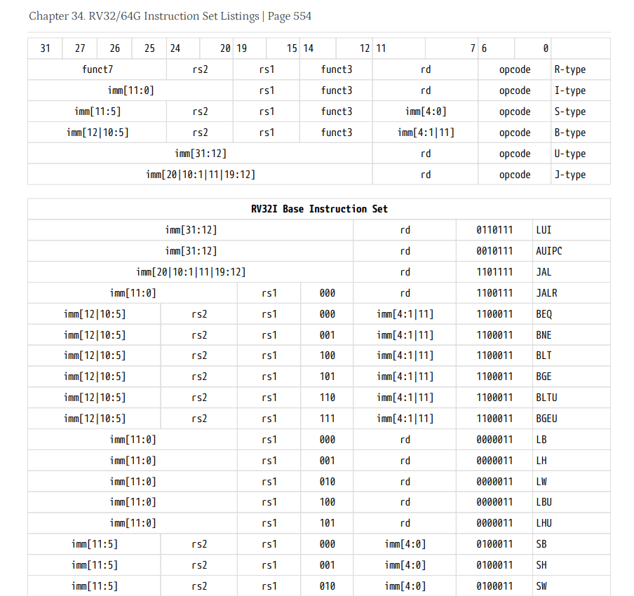

# Lecture 4

# RISC-V Instructions

## Lecture

Slides ([PDF](CA_Lecture_04.pdf), [PPTX](CA_Lecture_04.pptx)).

#### Outline

* Stored program concept.
* Memory layout.
* RISC-V ISA base and extensions.
* Instruction encoding (R, I, S, SB, U, and UJ formats).

## Workshop

#### Outline

* Discuss the tasks from the previous seminar.
* Get familiar with the RISC-V ISA Specification (instruction types, encodings, etc.).
* Practice with encoding and decoding instructions.
* Get familiar with pseudoinstructions.
* Understand the use of labels and branch instructions.
* Practice writing programs with conditions and loops.

#### Tasks

See "Chapter 34. RV32/64G Instruction Set Listings" (page 572) of document ["The RISC-V Instruction Set
Manual Volume I"](https://drive.google.com/file/d/1uviu1nH-tScFfgrovvFCrj7Omv8tFtkp/view?usp=drive_link) to
get instruction encodings.



1. Encode the following instructions to the binary format (see the rules in
   the ISA specification):

   * R-type:

         add  t3, t1, t2

   * I-type:   

         ori  s0, t1, 0x123
         lw   t1, 0x8(t0)
         
   * S-type:
   
         sw   t1, 0x8(t0)

   * SB-type:

         beq t2, t3, 16
         beq t2, t3, -8

   * U-type:
   
         lui  t0, 0x12345

   * UJ-type:

         jal zero, 16

1. Decode the following hexademical values to instructions:

       0x98765437
       0x00744433
       0x0080006f
       0xfff37293
       0x00000463
       0x00032823

1. Get familiar with RISC-V pseudoinstructions (`mv`, `li`, `la`, `b`, `j`, etc).
   What instructions are used to replace them when a program is assembled:

       mv t0, t1
       li t0, 0x12345678
       li t0, 16
       b  label
       j  label
       la t0, label
       
    Note: Add `label` to some place in your code. See what code will be generated in
    the `Execute` panel of RARS. 

1. Write a program that inputs an integer value `x` and prints `-1` if it is negative, `0` if it equals 0,
   and `1` if it is positive.
   
   On if the solutions is this:
   
       main:
           li   a7, 5
           ecall
          
           mv   t0, zero
           beqz a0, done
           li   t0, 1
           blt  zero, a0, done  
           li   t0, -1
       done:
           li a7, 1
           mv a0, t0
           ecall

   Propose any other solution?

1. Write a program that inputs two integer values `x` and `y` and prints first the smallest
   of them and then the largest of them.

## Homework

### Task 1

Decompile the program (convert instructions from the binary representation into assembly source code),
put the source code into RARS and run it. What is an output?

Rewrite the program using a smaller number of instructions.

```
0x6c6c6337
0x54830313
0x412033b7
0xc6f38393
0x00535e37
0xf43e0e13
0x10010437
0x00040413
0x00642023
0x00742223
0x01c42423
0x00400893
0x00800533
0x00000073
```

### Task 2

Decompile the program, put the source code into RARS and run it.
What arithmetic operation this program is doing?

Rewrite the program using a smaller number of instructions (_hint:_ use RV32M extension instructions).

```
0x00500893  3 
0x00000073  4 
0x00a00333  5  # store "a"
0x01f55293  6  # store sign of "a"
0x00000073  8 
0x00a00eb3  9  # store "b"
0x01f55e13  10 # store sign of "b"
0x06030263  12
0x060e8063  13
0x00028663  15 # if "a" < 0 then inverse it
0xfff34313  16
0x00130313  17
0x000e0663  19 # if "b" < 0 then inverse it
0xfffece93  20
0x001e8e93  21
0x01d35863  24 # if "a" < "b" swap them
0x006eceb3  25
0x006ec333  26
0x006eceb3  27
0x000003b3  29
0x006383b3  31
0xfffe8e93  32
0xffd04ce3  33
0x01c2cfb3  36
0x000f8663  37
0xfff3c393  38
0x00138393  39 # t2 - result accumulator
0x00100893  41
0x00700533  42
0x00000073  43
0x00a00893  45
0x00000073  46
0x00100893  49 # if sign of "a" and "b" is different then negate the result
0x00000533  50
0x00000073  51
0x00a00893  52
0x00000073  53
```

## References

* Machine Language. Section 6.4 in [[DDCA]](../../books.md).
* [RISC-V Technical Specifications](https://lf-riscv.atlassian.net/wiki/x/kYD2) - official standards
* [The RISC-V Instruction Set Manual. Volume I: Unprivileged ISA](
  https://github.com/riscv/riscv-isa-manual/releases/latest) - drafts
* [Opcode](https://en.wikipedia.org/wiki/Opcode) (Wikipedia).
* [Addressing Mode](https://en.wikipedia.org/wiki/Addressing_mode) (Wikipedia).
* [C++ library for RISC-V instruction encoding](
  https://github.com/andrewt0301/project_X/blob/main/src/isa/riscv64/riscv64.h) (for illustration).
* [Formal specification of RISC-V ISA](
  https://github.com/andrewt0301/ispras-microtesk-riscv/blob/master/microtesk-riscv/src/main/arch/riscv/model/riscv_rv32i.nml)
  (for illustration).
