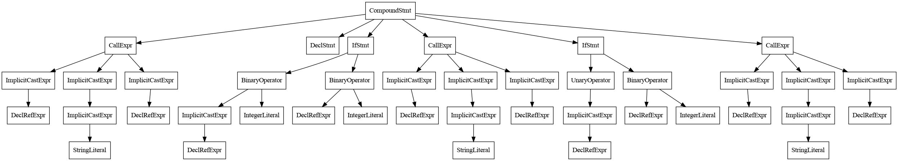
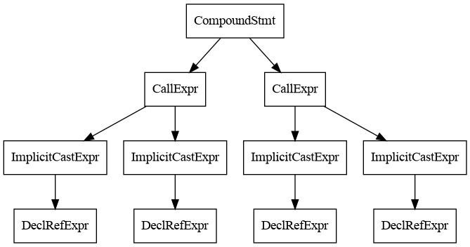

Lecture 15
---
# Compiler Infrastructure Clang/LLVM

## Lecture

Slides: [PDF](slides_14.pdf), [PPTX](slides_14.pptx)

Notes: [PDF](nodes_14.pdf)

#### Outline

* LLVM Project: history and architecture
* LLVM IR
* Clang: parser and static analysis tool
* Clang Static Analyzer and its symbolic execution engine
* Clang Extra Tools: Clang-Tidy

## Workshop

#### Outline

* Compiling/Installing LLVM
* Compiling C/C++ programs to executables and LLVM IR
* Exploring C/C++ programs with Clang (tokens, AST, call graph, CFG, exploded graph)
* Running Clang Static Analyzer
* Exploring Clang Static Analyzer and Clang-Tidy checks

#### Installing Clang

Clang is already installed in Mac OS. In Linux, it can be installed using the following command:

```bash
sudo apt install clang
```

#### Building Clang (optional, takes a long time)

For studying Clang source code, making experiments, and using features available to developers,
it is recommended to clone its sources from GitHub and build them.
_Warning: this may take several hours depending on your computer._

##### Cloning project from GitHub and checking our LLVM 20 (latest release):

```bash
git clone git@github.com:llvm/llvm-project.git
git checkout llvm-20
```

##### Installing visualization packages

Graphs that visualize internal data structures of a compiler
are described in the [DOT](https://en.wikipedia.org/wiki/DOT_%28graph_description_language%29)
format and rendered to an image with the help of the
[Graphviz](https://en.wikipedia.org/wiki/Graphviz) tool.

First, install the required visualization tools: 

```bash
sudo apt install graphviz
sudo apt install gv
sudo apt install xdot
sudo apt install python3-distutils-extra
```

Second, install the [Ninja](https://en.wikipedia.org/wiki/Ninja_%28build_system%29) build system.
It solves the same task as GNU Make, but it has better performance
(automatically generated scripts that efficiently parallelize build tasks). 

```bash
sudo apt install ninja-build
```

Third, build and install LLVM compiler infrastructure (this is a debug build with
some optimizations that reduce build time and size of the files).
That is interesting, we build a debug version of Clang 20, with installed version of Clang 18.

```bash
cd /home/andrewt/Documents/src/llvm-project/
mkdir build
cd build
env CC=`which clang` CXX=`which clang++` cmake \
  -DCMAKE_BUILD_TYPE=Debug \
  -GNinja \
  -DLLVM_ENABLE_PROJECTS='clang;clang-tools-extra' \
  -DLLVM_TARGETS_TO_BUILD="X86" \
  -DBUILD_SHARED_LIBS=ON \
  -DLLVM_OPTIMIZED_TABLEGEN=ON \
  -DLLVM_USE_SPLIT_DWARF=ON \
  -DCMAKE_INSTALL_PREFIX=/home/andrewt/Programs/llvm/ \
  ../llvm
ninja install
export PATH=/home/andrewt/Programs/llvm/bin:$PATH
```

#### Build Hello World and viewing build phases

Build and run the [hello.c](hello.c) program:
```bash
clang hello.c -o hello
./hello 
Hello!
```

Build and see the list of build phases:
```bash
clang hello.c -o hello -ccc-print-phases
            +- 0: input, "hello.c", c
         +- 1: preprocessor, {0}, cpp-output
      +- 2: compiler, {1}, ir
   +- 3: backend, {2}, assembler
+- 4: assembler, {3}, object
5: linker, {4}, image
```
Print the command run by Clang under the hood to build the program:
```bash
lang hello.c -o hello -###
clang version 20.1.5 (https://github.com/llvm/llvm-project.git 7b09d7b446383b71b63d429b21ee45ba389c5134)
Target: x86_64-unknown-linux-gnu
Thread model: posix
InstalledDir: /home/andrewt/Programs/llvm/bin
Build config: +unoptimized, +assertions
 "/home/andrewt/Programs/llvm/bin/clang-20" "-cc1" "-triple" "x86_64-unknown-linux-gnu" "-emit-obj" "-dumpdir" "hello-" "-disable-free" "-clear-ast-before-backend" "-main-file-name" "hello.c" "-mrelocation-model" "pic" "-pic-level" "2" "-pic-is-pie" "-mframe-pointer=all" "-fmath-errno" "-ffp-contract=on" "-fno-rounding-math" "-mconstructor-aliases" "-funwind-tables=2" "-target-cpu" "x86-64" "-tune-cpu" "generic" "-debugger-tuning=gdb" "-fdebug-compilation-dir=/home/andrewt/Documents/src/hse/hse-acos-course/docs/part2os/15_Clang" "-fcoverage-compilation-dir=/home/andrewt/Documents/src/hse/hse-acos-course/docs/part2os/15_Clang" "-resource-dir" "/home/andrewt/Programs/llvm/lib/clang/20" "-internal-isystem" "/home/andrewt/Programs/llvm/lib/clang/20/include" "-internal-isystem" "/usr/local/include" "-internal-isystem" "/usr/lib/gcc/x86_64-linux-gnu/13/../../../../x86_64-linux-gnu/include" "-internal-externc-isystem" "/usr/include/x86_64-linux-gnu" "-internal-externc-isystem" "/include" "-internal-externc-isystem" "/usr/include" "-ferror-limit" "19" "-fgnuc-version=4.2.1" "-fskip-odr-check-in-gmf" "-fcolor-diagnostics" "-faddrsig" "-D__GCC_HAVE_DWARF2_CFI_ASM=1" "-o" "/tmp/hello-da670c.o" "-x" "c" "hello.c"
 "/usr/bin/ld" "-z" "relro" "--hash-style=gnu" "--eh-frame-hdr" "-m" "elf_x86_64" "-pie" "-dynamic-linker" "/lib64/ld-linux-x86-64.so.2" "-o" "hello" "/lib/x86_64-linux-gnu/Scrt1.o" "/lib/x86_64-linux-gnu/crti.o" "/usr/lib/gcc/x86_64-linux-gnu/13/crtbeginS.o" "-L/usr/lib/gcc/x86_64-linux-gnu/13" "-L/usr/lib/gcc/x86_64-linux-gnu/13/../../../../lib64" "-L/lib/x86_64-linux-gnu" "-L/lib/../lib64" "-L/usr/lib/x86_64-linux-gnu" "-L/usr/lib/../lib64" "-L/lib" "-L/usr/lib" "/tmp/hello-da670c.o" "-lgcc" "--as-needed" "-lgcc_s" "--no-as-needed" "-lc" "-lgcc" "--as-needed" "-lgcc_s" "--no-as-needed" "/usr/lib/gcc/x86_64-linux-gnu/13/crtendS.o" "/lib/x86_64-linux-gnu/crtn.o"
```

#### Preprocessing

Preprocessing the [test.c](test.c) file (expanding all macros):

```bash
clang test.c -E
# 1 "test.c"
# 1 "<built-in>" 1
# 1 "<built-in>" 3
# 389 "<built-in>" 3
# 1 "<command line>" 1
# 1 "<built-in>" 2
# 1 "test.c" 2

void write_i(int);
void write_s(const char *);

void print(const char *s, int a) {
  write_s(s);
  write_i(a);
}

void foo(int x) {
  print("Value of " "x", x);
  int y, z;
  if (x == 0)
    y = 5;
  print("Value of " "y", y);
  if (!x)
    z = 6;
  print("Value of " "z", z);
}
```

See that the `trace` macro has been replaced by a call to function `print` and the integer argument
has been expanded to an additional argument holding its name.

#### Lexical analysis

Lexical analysis is the first stage of the compiler. During this stage, the compiler scans
a stream to characters and builds tokens (that describe identifiers, keywords, operators, etc.):

```bash
clang -cc1 -dump-tokens test.c
void 'void'	 [StartOfLine]	Loc=<test.c:3:1>
identifier 'write_i'	 [LeadingSpace]	Loc=<test.c:3:6>
l_paren '('		Loc=<test.c:3:13>
int 'int'		Loc=<test.c:3:14>
r_paren ')'		Loc=<test.c:3:17>
semi ';'		Loc=<test.c:3:18>
void 'void'	 [StartOfLine]	Loc=<test.c:4:1>
identifier 'write_s'	 [LeadingSpace]	Loc=<test.c:4:6>
l_paren '('		Loc=<test.c:4:13>
const 'const'		Loc=<test.c:4:14>
char 'char'	 [LeadingSpace]	Loc=<test.c:4:20>
star '*'	 [LeadingSpace]	Loc=<test.c:4:25>
r_paren ')'		Loc=<test.c:4:26>
semi ';'		Loc=<test.c:4:27>
void 'void'	 [StartOfLine]	Loc=<test.c:6:1>
identifier 'print'	 [LeadingSpace]	Loc=<test.c:6:6>
l_paren '('		Loc=<test.c:6:11>
const 'const'		Loc=<test.c:6:12>
char 'char'	 [LeadingSpace]	Loc=<test.c:6:18>
star '*'	 [LeadingSpace]	Loc=<test.c:6:23>
identifier 's'		Loc=<test.c:6:24>
comma ','		Loc=<test.c:6:25>
int 'int'	 [LeadingSpace]	Loc=<test.c:6:27>
identifier 'a'	 [LeadingSpace]	Loc=<test.c:6:31>
r_paren ')'		Loc=<test.c:6:32>
l_brace '{'	 [LeadingSpace]	Loc=<test.c:6:34>
identifier 'write_s'	 [StartOfLine] [LeadingSpace]	Loc=<test.c:7:3>
l_paren '('		Loc=<test.c:7:10>
identifier 's'		Loc=<test.c:7:11>
r_paren ')'		Loc=<test.c:7:12>
semi ';'		Loc=<test.c:7:13>
identifier 'write_i'	 [StartOfLine] [LeadingSpace]	Loc=<test.c:8:3>
l_paren '('		Loc=<test.c:8:10>
identifier 'a'		Loc=<test.c:8:11>
r_paren ')'		Loc=<test.c:8:12>
semi ';'		Loc=<test.c:8:13>
r_brace '}'	 [StartOfLine]	Loc=<test.c:9:1>
void 'void'	 [StartOfLine]	Loc=<test.c:11:1>
identifier 'foo'	 [LeadingSpace]	Loc=<test.c:11:6>
l_paren '('		Loc=<test.c:11:9>
int 'int'		Loc=<test.c:11:10>
identifier 'x'	 [LeadingSpace]	Loc=<test.c:11:14>
r_paren ')'		Loc=<test.c:11:15>
l_brace '{'	 [LeadingSpace]	Loc=<test.c:11:17>
identifier 'print'	 [StartOfLine] [LeadingSpace]	Loc=<test.c:12:3 <Spelling=test.c:1:18>>
l_paren '('		Loc=<test.c:12:3 <Spelling=test.c:1:23>>
string_literal '"Value of "'		Loc=<test.c:12:3 <Spelling=test.c:1:24>>
string_literal '"x"'	 [LeadingSpace]	Loc=<test.c:12:3 <Spelling=<scratch space>:2:1>>
comma ','		Loc=<test.c:12:3 <Spelling=test.c:1:38>>
identifier 'x'	 [LeadingSpace]	Loc=<test.c:12:3 <Spelling=test.c:12:9>>
r_paren ')'		Loc=<test.c:12:3 <Spelling=test.c:1:41>>
semi ';'		Loc=<test.c:12:11>
int 'int'	 [StartOfLine] [LeadingSpace]	Loc=<test.c:13:3>
identifier 'y'	 [LeadingSpace]	Loc=<test.c:13:7>
comma ','		Loc=<test.c:13:8>
identifier 'z'	 [LeadingSpace]	Loc=<test.c:13:10>
semi ';'		Loc=<test.c:13:11>
if 'if'	 [StartOfLine] [LeadingSpace]	Loc=<test.c:14:3>
l_paren '('	 [LeadingSpace]	Loc=<test.c:14:6>
identifier 'x'		Loc=<test.c:14:7>
equalequal '=='	 [LeadingSpace]	Loc=<test.c:14:9>
numeric_constant '0'	 [LeadingSpace]	Loc=<test.c:14:12>
r_paren ')'		Loc=<test.c:14:13>
identifier 'y'	 [StartOfLine] [LeadingSpace]	Loc=<test.c:15:5>
equal '='	 [LeadingSpace]	Loc=<test.c:15:7>
numeric_constant '5'	 [LeadingSpace]	Loc=<test.c:15:9>
semi ';'		Loc=<test.c:15:10>
identifier 'print'	 [StartOfLine] [LeadingSpace]	Loc=<test.c:16:3 <Spelling=test.c:1:18>>
l_paren '('		Loc=<test.c:16:3 <Spelling=test.c:1:23>>
string_literal '"Value of "'		Loc=<test.c:16:3 <Spelling=test.c:1:24>>
string_literal '"y"'	 [LeadingSpace]	Loc=<test.c:16:3 <Spelling=<scratch space>:3:1>>
comma ','		Loc=<test.c:16:3 <Spelling=test.c:1:38>>
identifier 'y'	 [LeadingSpace]	Loc=<test.c:16:3 <Spelling=test.c:16:9>>
r_paren ')'		Loc=<test.c:16:3 <Spelling=test.c:1:41>>
semi ';'		Loc=<test.c:16:11>
if 'if'	 [StartOfLine] [LeadingSpace]	Loc=<test.c:17:3>
l_paren '('	 [LeadingSpace]	Loc=<test.c:17:6>
exclaim '!'		Loc=<test.c:17:7>
identifier 'x'		Loc=<test.c:17:8>
r_paren ')'		Loc=<test.c:17:9>
identifier 'z'	 [StartOfLine] [LeadingSpace]	Loc=<test.c:18:5>
equal '='	 [LeadingSpace]	Loc=<test.c:18:7>
numeric_constant '6'	 [LeadingSpace]	Loc=<test.c:18:9>
semi ';'		Loc=<test.c:18:10>
identifier 'print'	 [StartOfLine] [LeadingSpace]	Loc=<test.c:19:3 <Spelling=test.c:1:18>>
l_paren '('		Loc=<test.c:19:3 <Spelling=test.c:1:23>>
string_literal '"Value of "'		Loc=<test.c:19:3 <Spelling=test.c:1:24>>
string_literal '"z"'	 [LeadingSpace]	Loc=<test.c:19:3 <Spelling=<scratch space>:4:1>>
comma ','		Loc=<test.c:19:3 <Spelling=test.c:1:38>>
identifier 'z'	 [LeadingSpace]	Loc=<test.c:19:3 <Spelling=test.c:19:9>>
r_paren ')'		Loc=<test.c:19:3 <Spelling=test.c:1:41>>
semi ';'		Loc=<test.c:19:11>
r_brace '}'	 [StartOfLine]	Loc=<test.c:20:1>
eof ''		Loc=<test.c:20:2>
```

In fact, Clang combines lexical analysis and preprocessing: it collects token that come
from different locations (current source file, included headers, and macros).

#### Syntactical analysis

The next compiler stage is to recognize syntactical structure of a source file.
At this stage, the compiler uses tokens to build
an [Abstract Syntax Tree](https://en.wikipedia.org/wiki/Abstract_syntax_tree)(AST).

Viewing AST as a text:

```bash
clang -cc1 -ast-dump test.c
TranslationUnitDecl 0x5cc40885cac8 <<invalid sloc>> <invalid sloc>
|-TypedefDecl 0x5cc40885d2f8 <<invalid sloc>> <invalid sloc> implicit __int128_t '__int128'
| `-BuiltinType 0x5cc40885d090 '__int128'
|-TypedefDecl 0x5cc40885d368 <<invalid sloc>> <invalid sloc> implicit __uint128_t 'unsigned __int128'
| `-BuiltinType 0x5cc40885d0b0 'unsigned __int128'
|-TypedefDecl 0x5cc40885d670 <<invalid sloc>> <invalid sloc> implicit __NSConstantString 'struct __NSConstantString_tag'
| `-RecordType 0x5cc40885d440 'struct __NSConstantString_tag'
|   `-Record 0x5cc40885d3c0 '__NSConstantString_tag'
|-TypedefDecl 0x5cc40885d718 <<invalid sloc>> <invalid sloc> implicit __builtin_ms_va_list 'char *'
| `-PointerType 0x5cc40885d6d0 'char *'
|   `-BuiltinType 0x5cc40885cb70 'char'
|-TypedefDecl 0x5cc40885da10 <<invalid sloc>> <invalid sloc> implicit __builtin_va_list 'struct __va_list_tag[1]'
| `-ConstantArrayType 0x5cc40885d9b0 'struct __va_list_tag[1]' 1 
|   `-RecordType 0x5cc40885d7f0 'struct __va_list_tag'
|     `-Record 0x5cc40885d770 '__va_list_tag'
|-FunctionDecl 0x5cc4088aedc0 <test.c:3:1, col:17> col:6 used write_i 'void (int)'
| `-ParmVarDecl 0x5cc4088aecf0 <col:14> col:17 'int'
|-FunctionDecl 0x5cc4088aefa0 <line:4:1, col:26> col:6 used write_s 'void (const char *)'
| `-ParmVarDecl 0x5cc4088aeed0 <col:14, col:25> col:26 'const char *'
|-FunctionDecl 0x5cc4088af1c0 <line:6:1, line:9:1> line:6:6 used print 'void (const char *, int)'
| |-ParmVarDecl 0x5cc4088af068 <col:12, col:24> col:24 used s 'const char *'
| |-ParmVarDecl 0x5cc4088af0e8 <col:27, col:31> col:31 used a 'int'
| `-CompoundStmt 0x5cc4088af418 <col:34, line:9:1>
|   |-CallExpr 0x5cc4088af308 <line:7:3, col:12> 'void'
|   | |-ImplicitCastExpr 0x5cc4088af2f0 <col:3> 'void (*)(const char *)' <FunctionToPointerDecay>
|   | | `-DeclRefExpr 0x5cc4088af278 <col:3> 'void (const char *)' Function 0x5cc4088aefa0 'write_s' 'void (const char *)'
|   | `-ImplicitCastExpr 0x5cc4088af330 <col:11> 'const char *' <LValueToRValue>
|   |   `-DeclRefExpr 0x5cc4088af298 <col:11> 'const char *' lvalue ParmVar 0x5cc4088af068 's' 'const char *'
|   `-CallExpr 0x5cc4088af3d8 <line:8:3, col:12> 'void'
|     |-ImplicitCastExpr 0x5cc4088af3c0 <col:3> 'void (*)(int)' <FunctionToPointerDecay>
|     | `-DeclRefExpr 0x5cc4088af348 <col:3> 'void (int)' Function 0x5cc4088aedc0 'write_i' 'void (int)'
|     `-ImplicitCastExpr 0x5cc4088af400 <col:11> 'int' <LValueToRValue>
|       `-DeclRefExpr 0x5cc4088af368 <col:11> 'int' lvalue ParmVar 0x5cc4088af0e8 'a' 'int'
`-FunctionDecl 0x5cc4088af4e0 <line:11:1, line:20:1> line:11:6 foo 'void (int)'
  |-ParmVarDecl 0x5cc4088af450 <col:10, col:14> col:14 used x 'int'
  `-CompoundStmt 0x5cc4088afbe8 <col:17, line:20:1>
    |-CallExpr 0x5cc4088af688 <line:1:18, col:41> 'void'
    | |-ImplicitCastExpr 0x5cc4088af670 <col:18> 'void (*)(const char *, int)' <FunctionToPointerDecay>
    | | `-DeclRefExpr 0x5cc4088af590 <col:18> 'void (const char *, int)' Function 0x5cc4088af1c0 'print' 'void (const char *, int)'
    | |-ImplicitCastExpr 0x5cc4088af6d0 <col:24, <scratch space>:2:1> 'const char *' <NoOp>
    | | `-ImplicitCastExpr 0x5cc4088af6b8 <test.c:1:24, <scratch space>:2:1> 'char *' <ArrayToPointerDecay>
    | |   `-StringLiteral 0x5cc4088af5f0 <test.c:1:24, <scratch space>:2:1> 'char[11]' lvalue "Value of x"
    | `-ImplicitCastExpr 0x5cc4088af6e8 <test.c:12:9> 'int' <LValueToRValue>
    |   `-DeclRefExpr 0x5cc4088af618 <col:9> 'int' lvalue ParmVar 0x5cc4088af450 'x' 'int'
    |-DeclStmt 0x5cc4088af818 <line:13:3, col:11>
    | |-VarDecl 0x5cc4088af718 <col:3, col:7> col:7 used y 'int'
    | `-VarDecl 0x5cc4088af798 <col:3, col:10> col:10 used z 'int'
    |-IfStmt 0x5cc4088af908 <line:14:3, line:15:9>
    | |-BinaryOperator 0x5cc4088af888 <line:14:7, col:12> 'int' '=='
    | | |-ImplicitCastExpr 0x5cc4088af870 <col:7> 'int' <LValueToRValue>
    | | | `-DeclRefExpr 0x5cc4088af830 <col:7> 'int' lvalue ParmVar 0x5cc4088af450 'x' 'int'
    | | `-IntegerLiteral 0x5cc4088af850 <col:12> 'int' 0
    | `-BinaryOperator 0x5cc4088af8e8 <line:15:5, col:9> 'int' '='
    |   |-DeclRefExpr 0x5cc4088af8a8 <col:5> 'int' lvalue Var 0x5cc4088af718 'y' 'int'
    |   `-IntegerLiteral 0x5cc4088af8c8 <col:9> 'int' 5
    |-CallExpr 0x5cc4088af9a8 <line:1:18, col:41> 'void'
    | |-ImplicitCastExpr 0x5cc4088af990 <col:18> 'void (*)(const char *, int)' <FunctionToPointerDecay>
    | | `-DeclRefExpr 0x5cc4088af928 <col:18> 'void (const char *, int)' Function 0x5cc4088af1c0 'print' 'void (const char *, int)'
    | |-ImplicitCastExpr 0x5cc4088af9f0 <col:24, <scratch space>:3:1> 'const char *' <NoOp>
    | | `-ImplicitCastExpr 0x5cc4088af9d8 <test.c:1:24, <scratch space>:3:1> 'char *' <ArrayToPointerDecay>
    | |   `-StringLiteral 0x5cc4088af948 <test.c:1:24, <scratch space>:3:1> 'char[11]' lvalue "Value of y"
    | `-ImplicitCastExpr 0x5cc4088afa08 <test.c:16:9> 'int' <LValueToRValue>
    |   `-DeclRefExpr 0x5cc4088af970 <col:9> 'int' lvalue Var 0x5cc4088af718 'y' 'int'
    |-IfStmt 0x5cc4088afad0 <line:17:3, line:18:9>
    | |-UnaryOperator 0x5cc4088afa58 <line:17:7, col:8> 'int' prefix '!' cannot overflow
    | | `-ImplicitCastExpr 0x5cc4088afa40 <col:8> 'int' <LValueToRValue>
    | |   `-DeclRefExpr 0x5cc4088afa20 <col:8> 'int' lvalue ParmVar 0x5cc4088af450 'x' 'int'
    | `-BinaryOperator 0x5cc4088afab0 <line:18:5, col:9> 'int' '='
    |   |-DeclRefExpr 0x5cc4088afa70 <col:5> 'int' lvalue Var 0x5cc4088af798 'z' 'int'
    |   `-IntegerLiteral 0x5cc4088afa90 <col:9> 'int' 6
    `-CallExpr 0x5cc4088afb70 <line:1:18, col:41> 'void'
      |-ImplicitCastExpr 0x5cc4088afb58 <col:18> 'void (*)(const char *, int)' <FunctionToPointerDecay>
      | `-DeclRefExpr 0x5cc4088afaf0 <col:18> 'void (const char *, int)' Function 0x5cc4088af1c0 'print' 'void (const char *, int)'
      |-ImplicitCastExpr 0x5cc4088afbb8 <col:24, <scratch space>:4:1> 'const char *' <NoOp>
      | `-ImplicitCastExpr 0x5cc4088afba0 <test.c:1:24, <scratch space>:4:1> 'char *' <ArrayToPointerDecay>
      |   `-StringLiteral 0x5cc4088afb10 <test.c:1:24, <scratch space>:4:1> 'char[11]' lvalue "Value of z"
      `-ImplicitCastExpr 0x5cc4088afbd0 <test.c:19:9> 'int' <LValueToRValue>
        `-DeclRefExpr 0x5cc4088afb38 <col:9> 'int' lvalue Var 0x5cc4088af798 'z' 'int'
```

Viewing AST as a picture (requires a debug build of Clang):

```bash
clang -cc1 -ast-view test.c
```

Function `foo`:


Function `print`:


3. Dump and view call graph:
   ```bash
   clang -cc1 -analyze -analyzer-checker="debug.DumpCallGraph" test.c
   clang -cc1 -analyze -analyzer-checker="debug.ViewCallGraph" test.c
   ```

4. View CFG and Exploded Graph:
   ```bash
   clang -cc1 -analyze -analyzer-checker="debug.ViewCFG" test.c
   clang -cc1 -analyze -analyzer-checker="debug.ViewExplodedGraph" test.c
   ```

## References

* [LLVM](https://en.wikipedia.org/wiki/LLVM) (Wikipedia)
* [Clang](https://en.wikipedia.org/wiki/Clang) (Wikipedia)
* [LLVM Web Site](https://llvm.org/)
* [LLVM Project](https://github.com/llvm/llvm-project) (GitHub)
* [Clang Static Analyzer - A Checker Developer's Guide](
  https://github.com/haoNoQ/clang-analyzer-guide/releases/download/v0.1/clang-analyzer-guide-v0.1.pdf)
* [[LLVM]](../../books.md#tool-books) Chapters 2, 3, 4, 5, 9, 10
* [LLVM Language Reference Manual](https://llvm.org/docs/LangRef.html)
